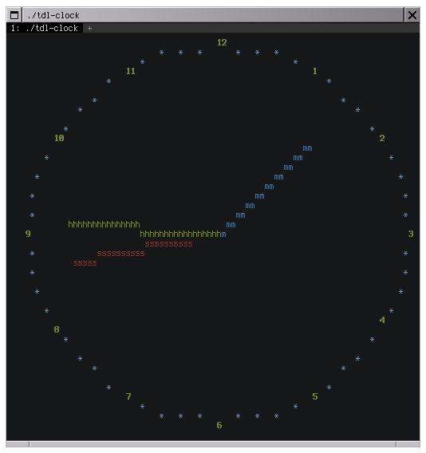
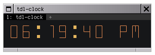

# tdl-clock

## Archivation note
This is an old nanoproject from 2022.

## Original README

An ASCII analog clock and digital clock written in C.

This program does not use curses for console graphics. It uses [TDL](https://github.com/celtrecium/tdl), a curses-like library written by my friend [Celtrecium](https://github.com/celtrecium).

Analog clock

  

Digital clock (12-hour time)

  

Your terminal must support basic ANSI escape codes (16 colors, bold font, hiding cursor and alternate screen for convenience) to use this program.
If you are going to use the digital clock, make sure that your terminal uses a font compatible with Unicode.

## Building

With CMake >= 3.11.4 (supported compilers are GCC and Clang):
1. `mkdir build && cd build`
2. `cmake ..`
3. `cmake --build .` or name of used generator

After building, there should be the `tdl-clock` binary in the build directory.

If you wish to install it, then in the build directory type `cmake --install .` (you may need root privileges to do this).
If your CMake installation is older than the 3.15 version, type `cmake --build . --target install` instead.

## Usage

Running `tdl-clock` without any params shows an analog clock with hour, minute and second hand.
To exit the clock, press `Control + C`.

To run the digital clock, pass the `-d` or `--digital` param.

To disable second hand in analog clock/seconds in digital clock, pass `--hm`.

By default, the digital clock uses the 24-hour time. If you wish to use the 12-hour time, pass `--12`.

There is also a help menu which can be accessed by passing `-h` or `--help`.

## Third-party libraries

These third-party libraries are used by this program. The CMake file automatically downloads and builds them.

* [argparse](https://github.com/cofyc/argparse)
* [TDL](https://github.com/celtrecium/tdl)
* [libu8string](https://github.com/celtrecium/libu8string)
* [libsbvector](https://github.com/celtrecium/libsbvector)
